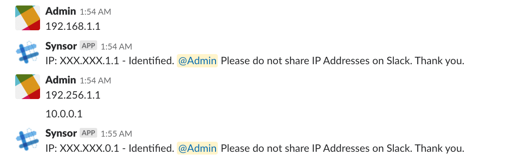

For a while, I wondered how easy it was to read messages in Slack on the backend. Turns out pretty easy; less than 10 lines of code and just a bot in the channel. To illustrate, I created a simple Slackbot to monitor chat for IP Addresses (Real IPs Only). If any are found, Synsor will reply to the user with a message.

